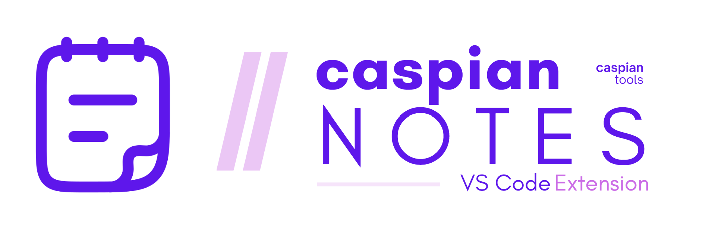

# Caspian Notes



A personal notes library for VS Code. Store notes as Markdown files, browse them in an Instagram-style masonry grid, filter by tags, and one-click copy, insert at cursor, or send to your AI chat extension of choice.

[](https://marketplace.visualstudio.com/items?itemName=CaspianTools.caspian-notes)
[](https://marketplace.visualstudio.com/items?itemName=CaspianTools.caspian-notes)
[](https://marketplace.visualstudio.com/items?itemName=CaspianTools.caspian-notes)
[](LICENSE)
[](https://github.com/Caspian-Explorer/caspian-notes/actions/workflows/ci.yml)

## Features

- **Masonry library** — variable-height cards arranged in a responsive multi-column grid that reflows as you resize the panel.
- **Activity-bar sidebar** — a dedicated tree view lists every note with right-click Copy / Insert / Edit / Send to Chat / Delete.
- **Grid / list toggle** — Google Keep-style switch between masonry and compact list view; persists per webview.
- **Tag filtering** — chip row above the grid, click to combine filters (AND semantics). Tag counts update as you add and remove notes.
- **Instant search** — substring match across title, body, and tags. `/` focuses the search box.
- **Markdown storage** — one `.md` file per note with YAML frontmatter. Readable outside the extension, git-friendly.
- **Global library** — notes live in VS Code's global storage so the same library shows up in every workspace.
- **Four card actions** — copy to clipboard, insert at cursor, open in edit view, or send to chat (configurable command ID).

## Install

**VS Code Marketplace:** `ext install CaspianTools.caspian-notes`

**Open VSX:** available via the `ovsx` published release.

**From source:** `git clone`, `npm install`, `npm run compile`, then `vsce package` and install the produced `.vsix`.

## Usage

1. Click the Caspian Notes icon in the activity bar (the masonry glyph) — or run `Caspian Notes: Open Notes Library` from the command palette for the full grid.
2. In the sidebar, use **+** (view-title) to add your first note, or right-click any item for Copy / Insert / Edit / Send to Chat / Delete.
3. In the full grid, click a card to run the default action (`copy` by default). Hover to reveal per-action buttons: **Copy**, **Insert**, **Chat**, **Edit**.

### Commands

| Command | What it does |
|---|---|
| `Caspian Notes: Open Notes Library` | Opens the masonry grid in the active editor column. |
| `Caspian Notes: New Note` | Opens the library and focuses the editor modal. |
| `Caspian Notes: Insert Note at Cursor` | QuickPick picker that inserts the chosen note body at the cursor. Useful with keybindings. |
| `Caspian Notes: Refresh` | Refreshes the sidebar tree (usually updates automatically via store change events). |

### Keyboard shortcuts inside the panel

| Key | Action |
|---|---|
| `/` | Focus search |
| `Ctrl/Cmd + N` | New note |
| `Enter` / `Space` on a card | Run default action |
| `Esc` | Close editor modal |
| `Ctrl/Cmd + Enter` in editor | Save |

## Settings

| Setting | Default | Description |
|---|---|---|
| `caspianNotes.defaultCardAction` | `"copy"` | Action when you click a card: `copy`, `insert`, or `edit`. |
| `caspianNotes.chatCommand` | `"workbench.action.chat.open"` | VS Code command ID invoked by **Chat**. The note body is passed as its argument. |
| `caspianNotes.minColumnWidth` | `260` | Minimum masonry column width in pixels. |

### Send-to-chat compatibility

The default `workbench.action.chat.open` works with GitHub Copilot Chat and other extensions that register on the generic chat command. For **Claude Code**, look up the current command ID (it varies across versions) and set `caspianNotes.chatCommand` accordingly. If the configured command fails, the body is copied to your clipboard as a fallback.

## Storage

Notes are stored at `context.globalStorageUri/notes/*.md`. Each file is a human-readable Markdown document with frontmatter:

```md
---
id: 4f9c2e4e-...
title: Code review
tags:
  - review
  - claude
createdAt: 2026-04-25T12:00:00.000Z
updatedAt: 2026-04-25T12:00:00.000Z
---

Review the following code for…
```

You can manually copy the `notes/` folder between machines. VS Code **Settings Sync does not sync `globalStorageUri`** — cross-device sync will be added in a future release (see `CHANGELOG.md`).

## Screenshots

Screenshots will appear here once captured (place 3 PNGs at `media/screenshots/{grid,sidebar,editor}.png` then reference them):

```


```

## License

MIT
